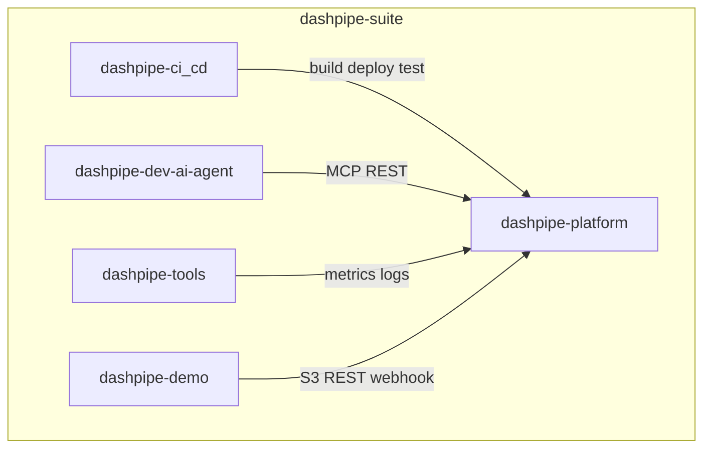

# Monorepo Layout

dashpipe-suite groups the platform and its supporting packages into five top-level components.



## Components

| Directory | Owns | Does not own |
|-----------|------|--------------|
| **dashpipe-platform** | `dashpipe-api`, `dashpipe-ui`, `dashpipe-spi`, `dashpipe-broker`, `pipelets/`, platform `docs/` | Deploy scripts, observability configs, demo mocks |
| **dashpipe-ci_cd** | `scripts/localdev.sh`, Azure Bicep, K8s manifests, assemblies, smoke/e2e tests | Business logic, UI features |
| **dashpipe-dev-ai-agent** | LangGraph agents, AI UI, Ollama compose, `dashpipe-mcp` | Runtime pipeline execution |
| **dashpipe-tools** | Prometheus, Grafana, ELK configs and compose profiles | API metrics emission (that stays in platform) |
| **dashpipe-demo** | Petstore mocks, LocalStack compose service, demo K8s overlays, sample pipeline JSON | Production data plane |

## When to change which component

| Change type | Component |
|-------------|-----------|
| New REST endpoint or Flyway migration | `dashpipe-platform` |
| New pipelet or `_common` runtime helper | `dashpipe-platform/pipelets` |
| Builder UI feature | `dashpipe-platform/dashpipe-ui` |
| Localdev script or Azure deploy fix | `dashpipe-ci_cd` |
| Grafana dashboard or Prometheus scrape config | `dashpipe-tools` |
| Mock API or sample pipeline JSON for demos | `dashpipe-demo` |
| MCP tool or AI prompt | `dashpipe-dev-ai-agent` |

## Docker Compose

Root [docker-compose.yml](../../docker-compose.yml) uses Compose `include` to pull in:

- `dashpipe-ci_cd/docker-compose.platform.yml` — MySQL, RabbitMQ
- `dashpipe-demo/docker-compose.demo.yml` — LocalStack, Petstore
- `dashpipe-tools/docker-compose.tools.yml` — Prometheus, Grafana, ELK (profiles)

## Build entrypoints

```bash
# Platform
./dashpipe-platform/mvnw -f dashpipe-platform -pl dashpipe-api -am test
cd dashpipe-platform/dashpipe-ui && npm test

# AI agent
cd dashpipe-dev-ai-agent/api && pytest
cd dashpipe-dev-ai-agent/dashpipe-mcp && pytest

# Full local stack
./dashpipe-ci_cd/scripts/localdev.sh start
```

See [Development setup](../contributing/DEVELOPMENT.md) for details.
