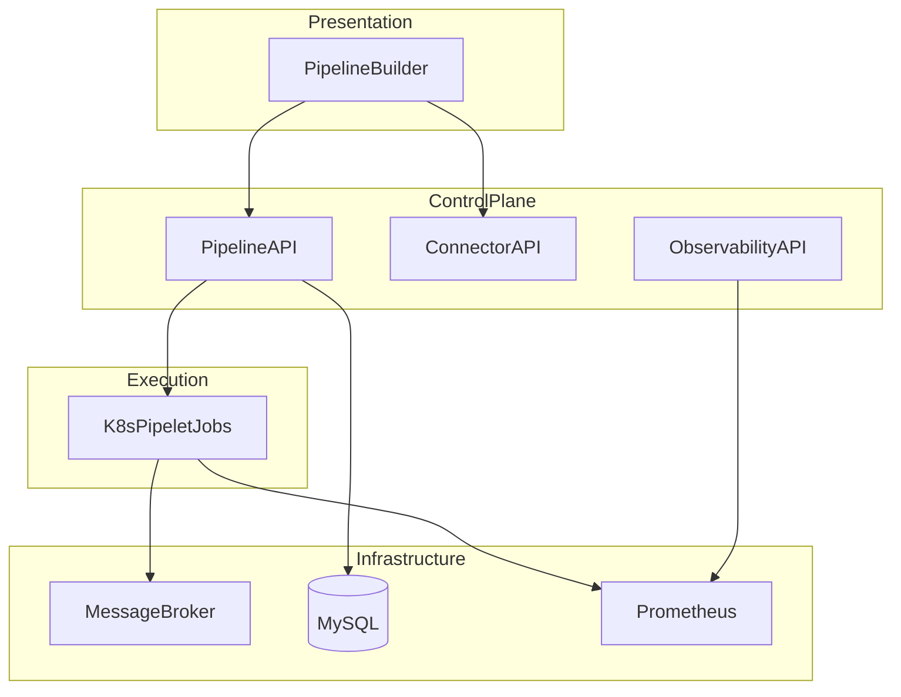

# Architecture Overview

One-page summary of the Dashpipe system. For full API schemas, data model, and SPI details, see [ARCHITECTURE.md](../../dashpipe-platform/docs/ARCHITECTURE.md).

## Layers

| Layer | Components |
|-------|------------|
| **Presentation** | React UI — pipeline builder, connector wizard, observability panels |
| **Control plane** | Spring Boot API — pipelines, tenants, connectors, executions, billing |
| **Execution** | Kubernetes Jobs running pipelet container images per pipeline stage |
| **Messaging** | Pluggable broker (RabbitMQ local, Azure Service Bus cloud) |
| **Data** | MySQL — metadata, usage, billing |
| **Observability** | Prometheus + Grafana + optional ELK ([dashpipe-tools](../../dashpipe-tools/)) |

## Request flow

## Core concepts

| Concept | Description |
|---------|-------------|
| **Tenant** | Isolated namespace for pipelines, connectors, and executions (`X-Tenant-Id` header) |
| **Pipeline** | Linear sequence of steps; statuses: draft → active → archived |
| **Pipelet** | Containerized processing unit (Source, Processor, Destination) |
| **Connector** | Tenant-scoped credentials/config for external systems (REST, S3, webhooks) |
| **Execution** | A single run of an active pipeline with per-step status and logs |

## Deployment topologies

| Assembly | Broker | Database | Runtime |
|----------|--------|----------|---------|
| **local** | RabbitMQ (Compose) | MySQL (Compose) | Local Kubernetes (Rancher Desktop) |
| **azure** | Azure Service Bus | Azure MySQL Flexible | AKS |

See [ASSEMBLIES.md](../../dashpipe-platform/docs/ASSEMBLIES.md) and [Deployment guide](../operations/DEPLOYMENT.md).

## Further reading

- [Monorepo layout](MONOREPO.md)
- [Service, connector, and pipelet model](../../dashpipe-platform/docs/SERVICE_CONNECTOR_PIPELET_MODEL.md)
- [Azure assembly](../../dashpipe-platform/docs/AZURE_ASSEMBLY.md)
